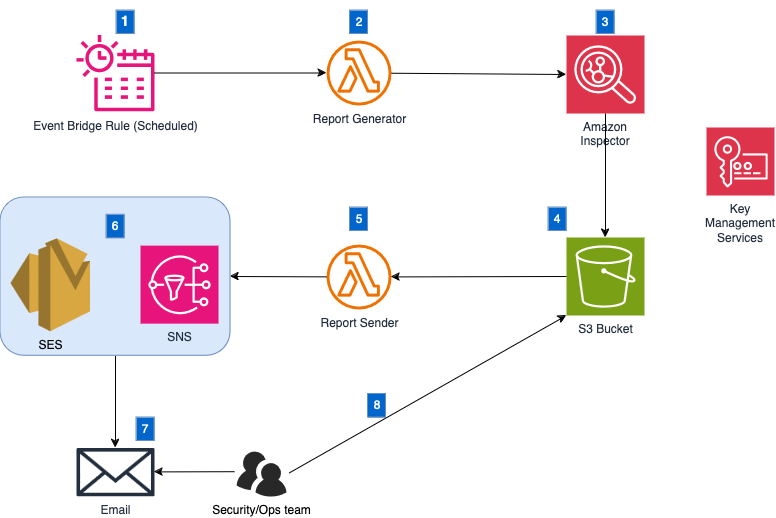
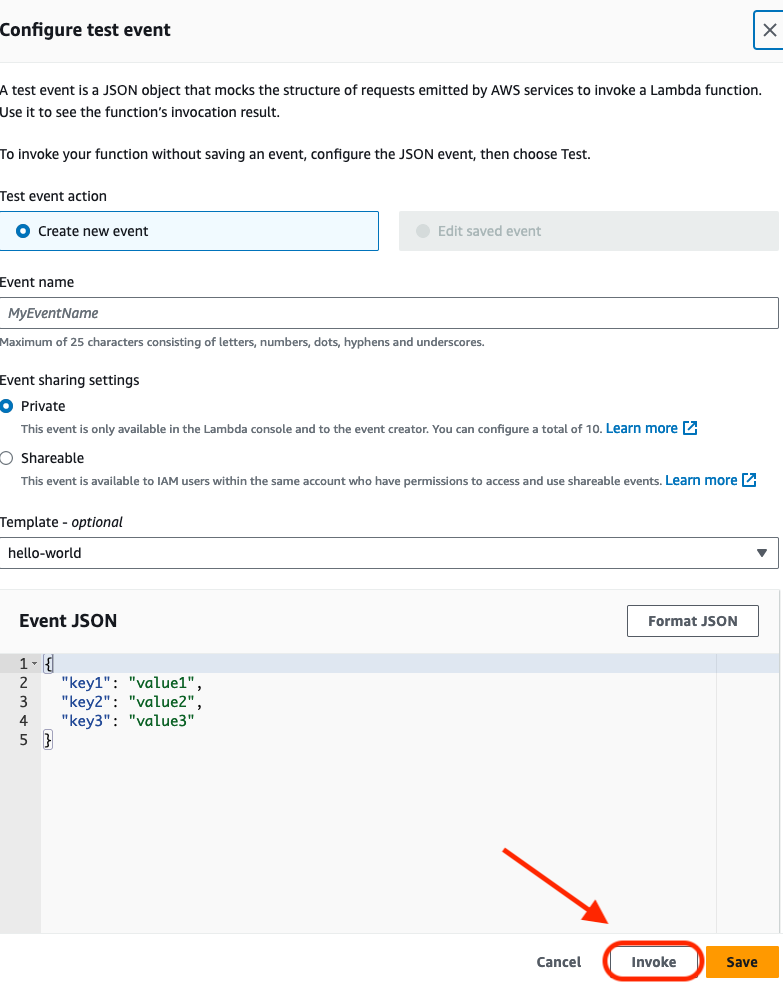
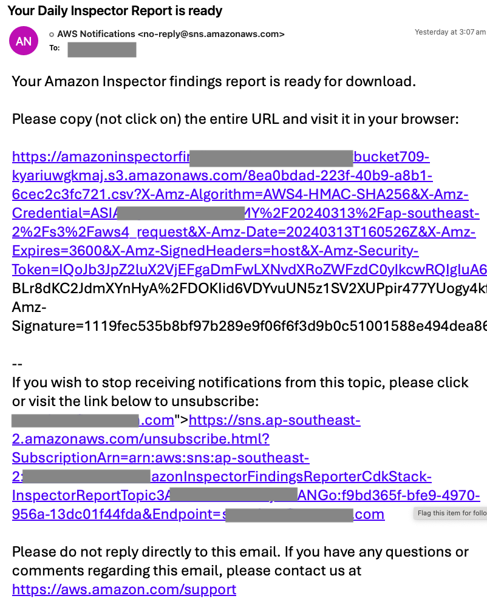
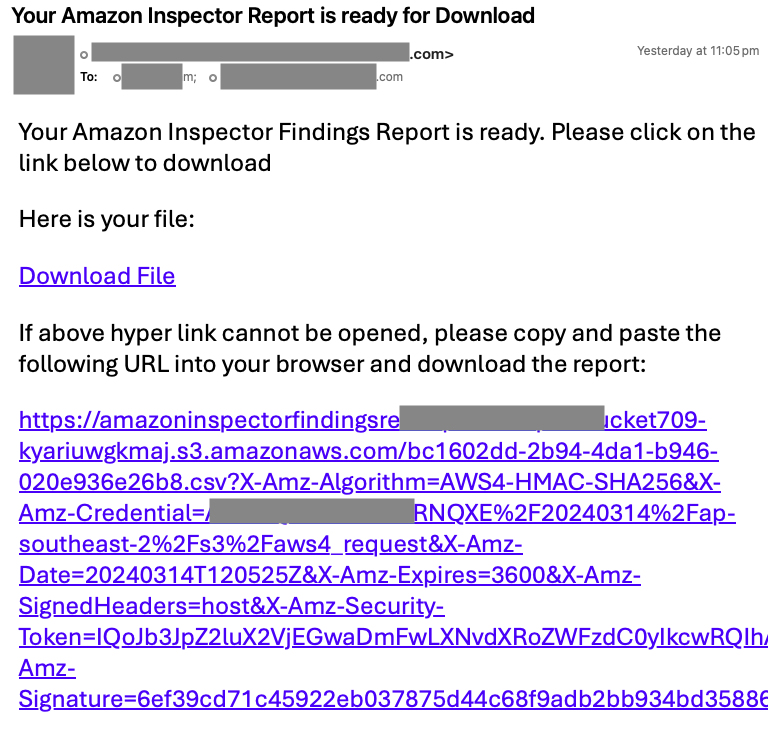

# Findings Reporter for Amazon Inspector


## Table of Contents


- [About this repo](#About-this-Repo)
- [Architecture](#architecture)
- [Features](#features)
- [Getting Started](#getting-started)
    - [Prerequisites](#prerequisites)
    - [Deployment Steps](#deployment-steps)
    - [Configuration](#configuration)
- [Usage](#usage)
- [Security](#security)
- [Testing](#testing)

## About this Repo


This repository contains a solution for automatically generating Amazon Inspector
finding reports periodically (e.g., every 24 hours) using the Amazon Inspector [CreateFindingsReport API](
https://docs.aws.amazon.com/inspector/v2/APIReference/API_CreateFindingsReport.html). 
The generated reports are stored in an S3 bucket, 
and notifications about the report availability are sent to Simple Notification System(SNS) subscribed 
by emails of the team. 
This solution is developed using the AWS Cloud Development Kit (CDK).

## Architecture



1. **Scheduled EventBridge Rule** invokes **Report Generator** Lambda function periodically (e.g. every 24 hours)
2. **Report Generator** creates Amazon Inspector findings reports, encrypts them with an AWS Key Management Services (KMS) Customer managed key(CMK)
3. **Amazon Inspector Service** stores the report to the **S3 bucket**
4. The **S3 bucket** is configured with an event notification rule which invoke **Report Sender** Lambda function when there is new upload to the bucket.
5. **Report Sender** Lambda function generates a **PreSignedURL** of the report for download. This function also builds the notification message going to an Amazon Simple 
Notification Service topic
6. There are two options to send out emails:
   - **SNS Topic** is subscribed by an email which can be your security or operational team. This option is used for simple setup. PreSigned URL may not be presented as a hyperlink as a whole, and thus needs manual copy and paste to browser to download the report. 
   - **Simple Email Service**: SES provides better user experience by showing entire PreSigned URL as hyperlink and also it supports HTML formatting.  
7. Your team receive the email including PreSignedURL of the report. 
8. You team uses the PreSignedURL to download the report

## Features

- Automated Findings Report Generation: Utilizes Amazon Inspector's inspectorv2 create-findings-report API to generate findings reports periodically.
- S3 Bucket Storage: Automatically stores the generated reports in a specified S3 bucket for easy access and archival.
- Email Notifications: Sends email notifications to the team using Amazon Simple Notification Service (SNS) when a new report is ready in the S3 bucket.
- Presigned URL Downloads: Reports can be downloaded via presigned URLs, enhancing security and providing temporary access.
- CloudFormation Deployment: The entire solution is deployable as an AWS CloudFormation template, making setup and replication across environments effortless. 
- CDK Development: Developed with the AWS Cloud Development Kit (CDK), offering a high-level object-oriented framework for defining cloud infrastructure in code.


## Getting Started 


### Prerequisites

- AWS Account
- AWS CLI configured with appropriate permissions
- Amazon Inspector is enabled
- Node.js and npm installed (for CDK deployment)
- AWS CDK Toolkit installed (npm install -g aws-cdk)
- Python(version 3.7 or later), pip and virtual environment installed

**Install the AWS CDK CLI**

```
npm install -g aws-cdk
```
Run the following command to verify a successful installation. The AWS CDK CLI should output the version number:

```
cdk --version
```


**Choosing AWS Account**

Please ensure your local machine is loaded with valid AWS Credentials which can:
- Have access to an account with Amazon Inspector enabled in the region as in your profile
- Sufficient privileges to Amazon Inspector service and to deploy CDK stacks 

**Bootstrap your environment**

To bootstrap, run the following:
```
cdk bootstrap aws://ACCOUNT-NUMBER/REGION
```

Please refer to [Getting started with the AWS CDK](https://docs.aws.amazon.com/cdk/v2/guide/getting_started.html)
for more details about installing AWS CDK 


### Deployment Steps
1. Create a Python-based CDK Project
```
mkdir my_project
cd my_project
cdk init app --language python
```
To work with the new project, activate its virtual environment. 
This allows the project's dependencies to be installed locally in the project folder, instead of globally.

```
source .venv/bin/activate
```
2. Clone the repository:
```
git clone git@github.com:aws-samples/findings-reporter-for-amazon-inspector.git
```
3. Copy all the files within the directory of `amazon-inspector-findings-reporter` paste and replace all files to your own CDK project
directory that you created in Step 1. 
```
cp -rf amazon-inspector-findings-reporter/ my_project/
cd my_project
```
4. Install dependencies
```
pip install -r requirements.txt
```
5. Update the following configurations in `context` section in [cdk.json](cdk.json):
- **notificationSystem**: this parameter is used to specify the service to deliver emails. You can use the following 
values: 
  - **SES**: use SES to send email
  - **SNS**: use SNS to send out notifications via email
- **ses_sender**: Sender email of your SES, for example `abc@example.com`. You need to specify this value when choosing **SES** as `notificationSystem`
- **ses_receivers**: a list of receipient email, for example ` ["cloudops@example.com","secops@example.com"]`. You need to specify this value when choosing **SES** as `notificationSystem`
- **sns_subscribed_emails**: a list of subscribed emails, for example `["cloudops@example.com","secops@example.com"]`. You need to specify this value when choosing **SNS** as `notificationSystem`

6. Synthesizing and deploying
- `cdk synth`: Synthesizes an AWS CloudFormation template from one or more of the stacks in your AWS CDK app.
- `cdk deploy`: Deploys the resources defined by one or more of the stacks in your AWS CDK app to AWS.

7. After Stack deployment completed, please check your email inbox and confirm subscription from SNS

## Configuration
- **Inspector Report Schedule:** Customize the schedule for the Inspector report generation within the CDK app as needed. 
Default schedule is to  send daily report at 00:05AM UTC every 24 hours.  The schedule can be customized by variable `schedule=events.Schedule.cron` in 
[amazon_inspector_findings_reporter_cdk_stack.py](amazon_inspector_findings_reporter_cdk/amazon_inspector_findings_reporter_cdk_stack.py#L147)

Once deployed, the system will automatically generate Amazon Inspector findings reports 
according to the configured schedule. Team members will receive email notifications with presigned URLs to download the 
reports directly from the S3 bucket.


## Security
- **PresignedURL**: Please ensure appropriate expiration time is set up for your presigned URL.
- **SNS Topic**: Please ensure only authorized admins can modify this SNS topic so that only approved 
emails can be added to the subscription.
- **S3 Bucket**: Only approved IAM identity can have access to the S3 bucket which stores Amazon Inspector Findings Report

## Testing
After deployment, the report will be generated and delivered to your email periodically (default is 00:05 AM UTC every 24 horus). 
To test the functionality or to generate the in on-demand basis, you can follow the steps below:

1. In AWS CloudFormation Console, find a stack with name `AmazonInspectorFindingsReporterCdkStack` 
2. Click on **Resources** tabin this stack
3. Find the resource with **Logical ID** starting with `InspectorReportFunction` and then click on its **Physical ID**
4. In new Lambda console, in the current **Code** tab, click on the **Test** button. 
5. In the **Configure test event** window, leave every as default and click on **Invoke** button at the bottom.

6. After a few minutes time, you will receive an email like below:
- SNS email example:
- 
- SES Email example:
- 

Instead of using AWS Management Console to invoke Lambda function, you can alternatively use AWS CLI to invoke Lambda function like below:
```
aws lambda invoke --function-name
```